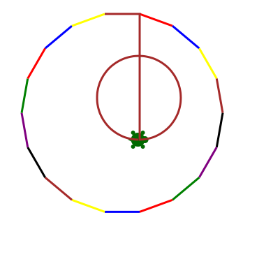

*"Nevertheless... the turtle moves!"* - Small Gods, by Terry Pratchett

This is a Turtle module for the Jupyter Notebook. It's based on code by
`aspidites <https://github.com/macewanCMPT395/aspidites>`_, one of two groups at
`Macewan University <http://macewan.ca/wcm/index.htm>`_ that built Turtle
as a class assignment (the other was `PACattack <http://macewancmpt395.github.io/PACattack/>`_;
I could have based this on either, but I had to pick one).

Using it looks like this::

    from mobilechelonian import Turtle
    t = Turtle()
    t.speed(5)
    colours=["red","blue","yellow","brown","black","purple","green"]

    t.penup(); t.left(90); t.forward(200);t.right(90);t.pendown()
    for i in range (0,18):
        t.pencolor(colours[i%7])
        t.right(20)
        t.forward(50)

    t.right(180)
    t.home()

.. image:: http://mybinder.org/badge.svg
   :target: https://beta.mybinder.org/v2/gh/takluyver/mobilechelonian/master?filepath=try.ipynb
